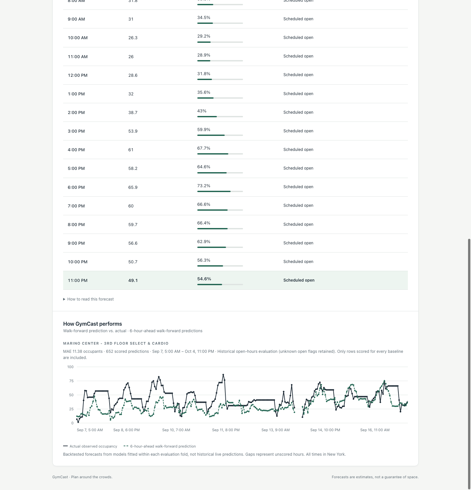
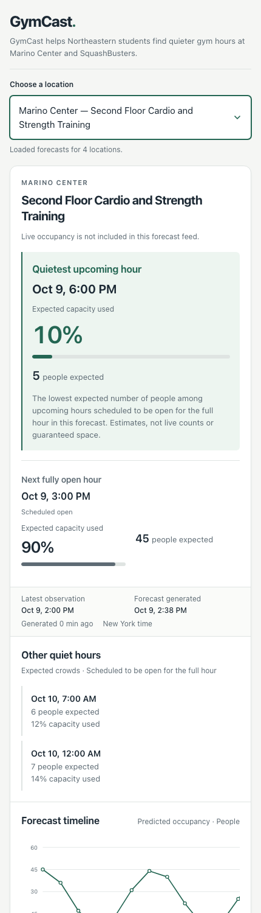

# GymCast

**Spend less time waiting for equipment. Find a better time to work out.**

Heading to Marino after class, or waiting until later? GymCast forecasts hourly
occupancy at Northeastern's Marino Center and SquashBusters locations so you can
plan around the crowds. It combines recent counts, daily and weekly patterns,
and activity at other campus locations to estimate the next 24 hours.

**117K+ leak-resistant walk-forward predictions · MAE: 7.57 occupants ·
10.9% lower MAE than the strongest overall baseline**

Evaluated across four weekly folds, scoring open hours at forecast horizons of
1–24 hours. The strongest overall baseline was the same hour last week.



**Working today:** a forecasting pipeline, JSON API, and responsive deployed frontend
with a location selector and hourly occupancy table. Availability labels distinguish
closed, partial, unknown, and scheduled-open hours. Quietest-hour highlights use
fully scheduled-open hours; current GoBoard evidence is shown when available.

[Live demo](https://gymcast.zakbmorgan.dev) · [Run it locally](#run-it-locally) ·
[Understand the pipeline](docs/pipeline_walkthrough.md) ·
[Architecture and current state](PROJECT.md)

## What makes a forecast useful?

GymCast predicts the average observed occupancy for each future hour. Its output
includes a predicted count, percentage of capacity, and the last observed hour
behind each location's forecast, so a fresh file cannot hide old input data.

Accuracy is checked against four simple alternatives: the current count, the
same hour yesterday, the same hour last week, and the historical hour-of-week
average. Each evaluation fold fits a fresh model on the past and tests forecasts
issued at or after that fit's cutoff. Every method is scored on the same valid
rows; the strongest baseline is determined by the results.

The saved evaluation report contains 117,791 scored predictions: model MAE 7.57
versus 8.51 for the strongest overall baseline. These are aggregate results;
performance can vary by horizon and evaluation period. See
[the current state](PROJECT.md#current-state) for the evidence and remaining work.

## How it works

```text
GoBoard observations, polled about every 5 minutes
                       ↓
               collector.py → raw CSV
                       ↓
               features.py → hourly panel
                       │
          ┌────────────┼──────────────────┐
          ↓            ↓                  ↓
       train.py    evaluate.py        predict.py
          ↓        fresh model       panel + saved model
     saved model   in each fold            ↓
                   vs. baselines     predictions.json
                                           ↓
                                       Flask API
                                           ↓
                                        Gunicorn
                                           ↓
                                         Nginx
                                      ↙          ↘
                                 frontend       /api/*
                                      \          /
                                       web browser
```

Training creates the saved model. Evaluation measures the modeling approach
independently of that artifact. Prediction applies the saved model to the latest
observations; evaluation is not a required step between training and prediction.

In production, collection runs continuously while a systemd timer rebuilds the
hourly features and current forecast every 15 minutes. Retraining remains a
separate manual process.

One model handles all forecast horizons, using the horizon itself as an input.
It uses LightGBM when available, with scikit-learn's
`HistGradientBoostingRegressor` as a compatibility fallback. GymCast does not
train both and automatically choose a winner.

Training and prediction share `build_supervised_frame()` and `design_matrix()`.
Occupancy features use only observations at or before the forecast origin;
target-hour time and calendar features are known in advance. The saved bundle
also preserves the category vocabulary and backend-specific input representation.
The [pipeline walkthrough](docs/pipeline_walkthrough.md) explains each boundary
with examples.

## Interface

GymCast is designed to make the forecast useful at a glance: choose a recreation
area, see the next fully open hour, compare quieter upcoming times, and inspect
the full 24-hour occupancy forecast.

The live deployment runs on a DigitalOcean droplet behind Nginx and Gunicorn.
GoBoard observations are collected continuously, and forecasts are regenerated
automatically every 15 minutes. The frontend reads the latest prepared forecast
through the Flask API.

### Desktop


### Mobile

<p align="center">
  
</p>

The interface includes availability-aware recommendations, capacity estimates,
a responsive hourly forecast table, and historical walk-forward predictions
compared with actual observed occupancy.

## Run it locally

From the repository root, on macOS/Linux:

```bash
python3 -m venv venv
venv/bin/python -m pip install -r requirements.txt
```

On macOS, install LightGBM's OpenMP runtime if you want that backend:

```bash
brew install libomp
```

If LightGBM cannot import or load its shared library, GymCast uses the sklearn
fallback. `train.py` prints the backend used. On Windows, use
`venv\Scripts\python.exe` in place of `venv/bin/python`.

### Collect history

Run the collector in a separate terminal, from the repository root:

```bash
cd src
../venv/bin/python collector.py
```

It is a continuous process with its own polling delay. Keep one instance running
in a terminal session or under a process supervisor; do not schedule a new
instance every five minutes. Failed requests go to `data/poll_errors.csv`.
Collected CSVs are local, gitignored artifacts and are not included in a clone.

### Build, train, and forecast

In another terminal, from the repository root:

```bash
cd src
../venv/bin/python features.py
../venv/bin/python train.py
../venv/bin/python predict.py
../venv/bin/python serve.py
```

The defaults resolve from `src/` to `../data`, `../models`, and `../outputs/`.
Training needs at least 50 supervised rows with observed origins and warns when
history spans less than 14 days. Early runs are smoke tests; the weekly lag needs
at least a week of history before it has values.

The API runs at `http://localhost:5000`:

| Endpoint | Behavior |
|---|---|
| `GET /api/predictions` | Reads the saved `outputs/predictions.json`; does not run the model. |
| `GET /api/evaluation-history?horizon=6` | Reads scored walk-forward history for one horizon; no evaluation runs on request. |
| `POST /api/refresh` | Rebuilds the hourly panel and predictions using the existing model. |

Refresh does not collect observations or retrain. Keep collection running
separately, and rerun `train.py` when you want to update the learned model.

### Evaluate against baselines

From `src/`:

```bash
../venv/bin/python evaluate.py --folds 4 --test-days 7 --max-horizon 24 \
  --report-out ../outputs/eval.json
```

Evaluation also writes `outputs/evaluation_predictions.json`, preserving every
scored location/target/horizon row from the fold's model. Use
`--predictions-out PATH` to change the destination, or `--predictions-out ''` to
disable export. The frontend's **How GymCast performs** section compares actual
occupancy with 6-hour-ahead walk-forward predictions for the selected location,
with MAE for that displayed series. These are backtests, not historical live
forecasts. Long histories scroll horizontally; missing scored hours remain gaps.
If the export is absent, current forecasts still work and history shows an empty state.
Restart Flask after updating it to register the history endpoint.

Defaults require roughly 28 days of history for one fold: 21 training days plus
7 test days. More history allows more folds. The report gives MAE (average
absolute error in people), RMSE, bias, and per-horizon MAE. Closed target hours
are excluded by default; use `--all-hours` to include them. Unknown open/closed
flags are retained. With the default filter, evaluation training rows are also
restricted to open or unknown hours.

Inspect the best baseline, per-horizon errors, and dropped-row counts together.
Beyond 24 hours, the 24-hour seasonal baseline is unavailable, so the common
scoring mask excludes those horizons from the current report.

### Run the tests without collected data

From the repository root:

```bash
venv/bin/python tests/test_pipeline.py
venv/bin/python tests/test_availability.py
venv/bin/python tests/test_evaluation_history.py
node tests/test_frontend.js     # frontend rendering checks; requires Node.js
```

The pipeline tests generate synthetic occupancy data and cover leakage, fold
boundaries, category consistency, serving features, and a model smoke test.
The separate availability suite checks schedule boundaries, overrides, DST,
live-evidence expiry, and unchanged occupancy output. Pytest is optional:
`venv/bin/python -m pytest tests/` if installed.

## Prediction output

Illustrative excerpt from `predictions.json` (one location and horizon):

```json
{
  "generated_at": "2026-10-04T15:05:00",
  "forecast_origin": { "Marino Center - Cardio": "2026-10-04 14:00:00" },
  "model_trained_through": "2026-10-03 23:00:00",
  "locations": {
    "Marino Center - Cardio": [
      {
        "time": "2026-10-04T15:00:00",
        "horizon_hours": 1,
        "predicted_count": 52.4,
        "predicted_percent": 26.2
      }
    ]
  }
}
```

`forecast_origin` is the last hour with an observed count for each location.
The forecast extends from that hour, even if collection has stalled. Compare it
with `generated_at` before presenting a forecast as current. Hour buckets are
labelled by their start time; live collection can include a partially observed
latest hour.

Counts are clipped at zero but not capped at capacity. Percentages are null
when capacity is unavailable; they can exceed 100%. These are point estimates,
without prediction intervals. Scheduled availability is attached separately;
closed-hour predictions are retained and are not changed to zero. See
[facility availability](docs/facility_availability.md) for maintained hours,
overrides, and expiring GoBoard current-state evidence.

## Data and remaining work

The collector reads public GoBoard facility counts for Northeastern locations.
It stores aggregate occupancy observations, location metadata, and polling
errors. Missing hourly observations remain `NaN`, not zero.

- **Dashboard:** the current view combines a native occupancy chart, compact forecast
  summary, and detailed availability table. Closed hours are hidden in the table
  by default with a Show closed hours toggle; the chart retains the full timeline.
  The table groups hours by day, summarizes up to three quietest fully open hours,
  preserves every forecast hour in the data, labels availability,
  and highlights only fully scheduled-open hours. Fresh live closures exclude
  the current hour; expired live evidence falls back to the schedule.
- **Validation:** rerun the corrected evaluation and check additional weeks and
  seasonal changes. Keep a final period untouched when tuning.
- **Academic calendar:** the join is implemented, but
  `data/academic_calendar.csv` is a header-only `date,semester_phase` template.
  Fill it with known dates; missing dates become `unknown`. `features.py` and
  `predict.py` accept `--calendar PATH` or `--calendar ''` to skip it.
- **Operations:** collection runs continuously on the production droplet, while
  feature construction and prediction refresh automatically every 15 minutes.
  Retraining remains a separate manual process.
- **Forecast range:** default training and prediction cover 1–24 hours.
  `train.py --max-horizon N` and `predict.py --hours-ahead N` change that range.
  Prediction warns, but proceeds, beyond the trained range. Seasonal lag inputs
  disappear beyond their 24- and 168-hour limits.

## Repository guide

| Path | Purpose |
|---|---|
| `src/` | Collection, panel construction, training, evaluation, prediction, and API |
| `tests/test_pipeline.py` | Standalone synthetic regression suite |
| `data/` | Local raw CSVs and hourly panel; committed calendar template |
| `models/` | Generated model bundle, gitignored |
| `outputs/` | Generated forecasts and evaluation reports, gitignored |
| `web/` | Responsive HTML/CSS/JavaScript frontend served by Nginx in production |
| [Pipeline walkthrough](docs/pipeline_walkthrough.md) | Detailed explanation with examples |
| [PROJECT.md](PROJECT.md) | Concise architecture, methodology, and current state |
| [AGENTS.md](AGENTS.md) | Coding conventions and correctness requirements |
| [CLAUDE.md](CLAUDE.md) | Entry point pointing to the shared agent guidance |

### Rebuilding after the raw timestamp correction

Old naive collector timestamps represent UTC from the droplet. The raw loader
now converts them to New York time before hourly bucketing; future collector
rows include an explicit UTC offset. Raw CSVs stay unchanged.

To replace artifacts built with the old timestamp interpretation, run from `src/`:

```bash
../venv/bin/python features.py
../venv/bin/python train.py
../venv/bin/python predict.py
../venv/bin/python evaluate.py
```
